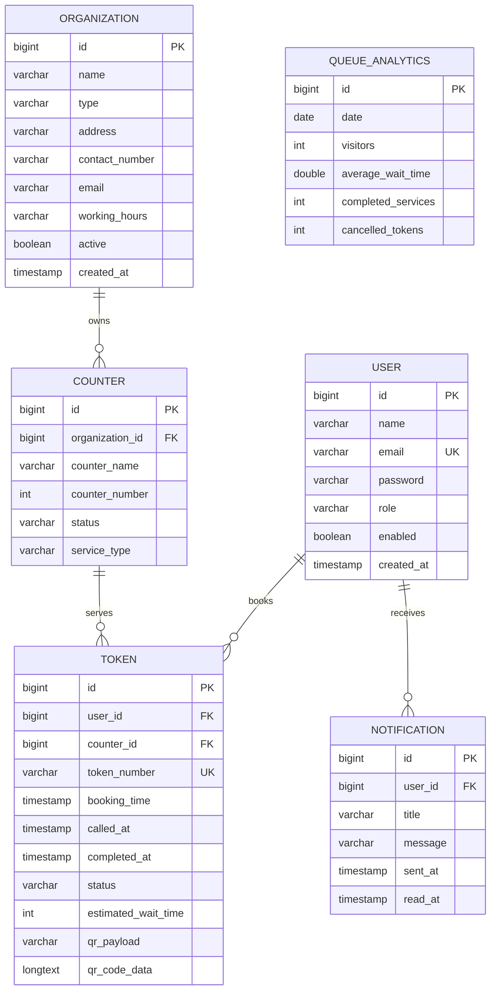

# ER Diagram

```mermaid
erDiagram
    USER ||--o{ TOKEN : books
    USER ||--o{ NOTIFICATION : receives
    ORGANIZATION ||--o{ COUNTER : owns
    COUNTER ||--o{ TOKEN : serves

    USER {
        bigint id PK
        varchar name
        varchar email UK
        varchar password
        varchar role
        boolean enabled
        timestamp created_at
    }

    ORGANIZATION {
        bigint id PK
        varchar name
        varchar type
        varchar address
        varchar contact_number
        varchar email
        varchar working_hours
        boolean active
        timestamp created_at
    }

    COUNTER {
        bigint id PK
        bigint organization_id FK
        varchar counter_name
        int counter_number
        varchar status
        varchar service_type
    }

    TOKEN {
        bigint id PK
        bigint user_id FK
        bigint counter_id FK
        varchar token_number UK
        timestamp booking_time
        timestamp called_at
        timestamp completed_at
        varchar status
        int estimated_wait_time
        varchar qr_payload
        longtext qr_code_data
    }

    NOTIFICATION {
        bigint id PK
        bigint user_id FK
        varchar title
        varchar message
        timestamp sent_at
        timestamp read_at
    }

    QUEUE_ANALYTICS {
        bigint id PK
        date date
        int visitors
        double average_wait_time
        int completed_services
        int cancelled_tokens
    }
```
